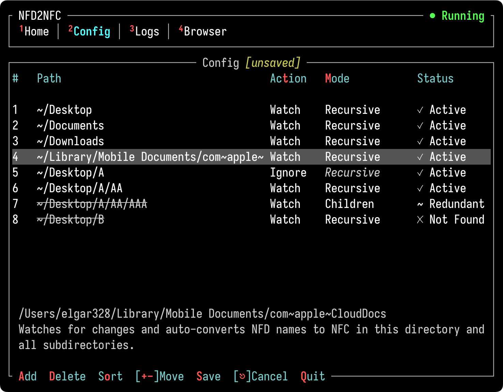
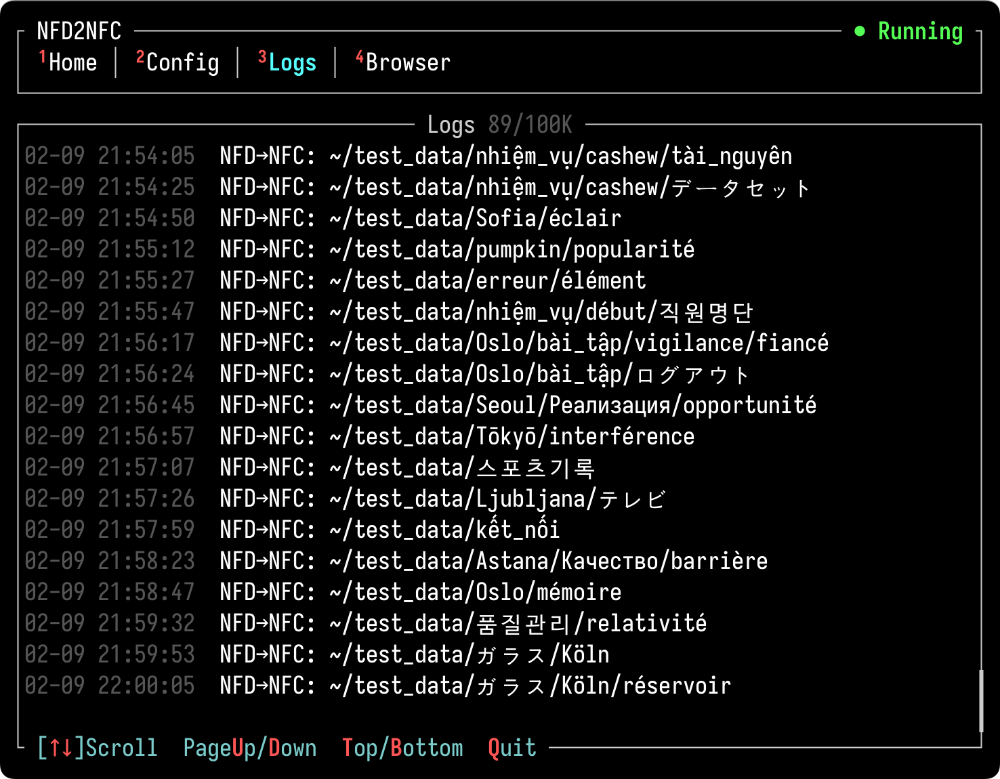
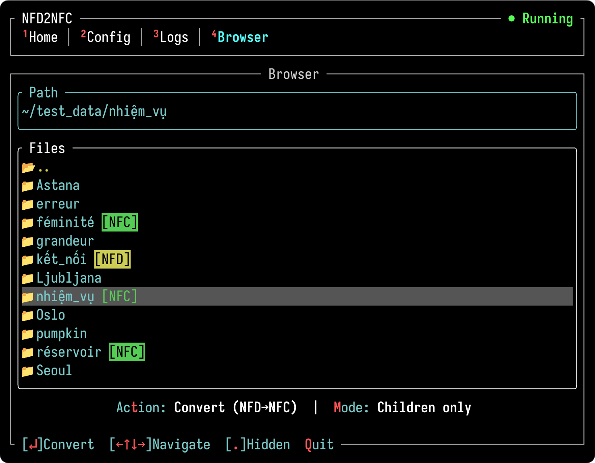

# nfd2nfc

[](https://github.com/elgar328/nfd2nfc/releases)
[](https://github.com/elgar328/nfd2nfc/actions/workflows/ci.yml)
[](https://github.com/elgar328/nfd2nfc#license)

[](../README.md)

NFD 파일명을 실시간으로 감지해 NFC로 변환하는 macOS 도구입니다. 다른 OS와 파일을 주고받을 때 생기는 파일명 깨짐 문제를 해결합니다.

## NFD/NFC란?

유니코드에는 한글, 악센트 문자(é, ü, ñ), 일본어(が, ぱ) 같은 조합 문자를 표현하는 두 가지 정규화 방식이 있습니다:

- **NFC** (조합형): 하나의 코드포인트 — `가` = `U+AC00`
- **NFD** (분해형): 기본 문자 + 결합 문자 — `가` = `U+1100 U+1161`

macOS는 파일명을 NFD로 저장하지만, Windows와 Linux는 NFC를 사용합니다. 이 차이 때문에 다른 OS와 파일을 주고받으면 다음과 같은 문제가 생깁니다:

- 한글이 자모로 풀어져서 표시됨 (예: 한글 → ㅎㅏㄴㄱㅡㄹ)
- 악센트 문자가 잘못 표시되거나 정렬이 깨짐
- Git이 같은 파일을 변경된 것으로 인식
- 클라우드 동기화나 압축 해제 시 경로를 찾지 못함

**nfd2nfc**는 TUI와 백그라운드 감시 서비스를 통해 이 문제를 자동으로 해결합니다.

## 주요 기능

- **실시간 감시** — NFD 파일명이 생성되면 즉시 NFC로 변환
- **감시 경로 설정** — `watch`/`ignore` 액션과 `recursive`/`children` 모드를 조합해 감시 범위를 세밀하게 조절
- **수동 변환** — 파일시스템을 탐색하면서 NFD/NFC를 직접 변환
- **로그 뷰어** — 과거 감시 로그 조회 및 실시간 로그 스트리밍
- **쉬운 조작** — 모든 단축키가 화면에 표시되고, 마우스도 지원

## Home


Home 탭에서 watcher 서비스의 현재 상태를 확인하고, 시작/중지/재시작할 수 있습니다.

## Config



Config 탭에서 감시할 디렉토리를 관리합니다. 각 경로의 액션(`watch` 또는 `ignore`), 모드(`recursive` 또는 `children`), 유효성 상태를 확인할 수 있습니다.

## Logs



Logs 탭에서 과거 watcher 로그를 조회하거나 실시간으로 확인할 수 있습니다. 로그는 macOS 시스템 로그에 기록되며, 보관 기간은 OS가 관리합니다.

## Browser



Browser 탭에서 파일과 디렉토리의 정규화 형식(NFD/NFC)을 확인하고 직접 변환할 수 있습니다. Watcher는 새로 생성/수정된 파일만 감지하므로, 기존 NFD 파일명은 이 탭에서 변환하세요.

## 제한 사항

nfd2nfc는 macOS가 파일명을 NFD로 저장하여 다른 OS에서 파일명이 깨지는 문제를 근본적으로 해결합니다. 다만 브라우저, 이메일 서비스, 클라우드 스토리지, 메시징 앱, 압축 도구 등은 파일을 주고받는 과정에서 자체적으로 파일명을 NFD로 변환할 수 있습니다. 이는 각 앱 고유의 동작으로, nfd2nfc가 관여할 수 없는 영역입니다.

## 설치 방법

[Homebrew](https://brew.sh)를 통해 설치할 수 있습니다:

```bash
brew install elgar328/nfd2nfc/nfd2nfc
```

실행:

```bash
nfd2nfc
```

처음 실행하면 watcher 서비스가 `brew services`에 자동 등록됩니다. 이후 앱에서 시작/중지할 수 있습니다.

### 권한 설정

Watcher가 파일을 변환할 때 macOS가 폴더 접근 권한을 반복적으로 요청한다면, watcher 바이너리에 **전체 디스크 접근 권한**을 부여하세요:

1. `which nfd2nfc-watcher`를 실행하여 바이너리 경로 확인
2. **시스템 설정 → 개인정보 보호 및 보안 → 전체 디스크 접근 권한** 열기
3. `+` 클릭 → `Cmd+Shift+G`를 눌러 1단계의 경로를 입력하고 추가

> **참고 — macOS Tahoe 26.1–26.2 버그:** 해당 버전에서는 CLI 바이너리를 전체 디스크 접근 권한에 추가할 수 없는 [알려진 문제](https://github.com/garethgeorge/backrest/issues/986)가 있습니다. macOS 26.3 베타에서 [수정된 것으로 보고](https://github.com/garethgeorge/backrest/issues/986#issuecomment-2889498423)되었습니다.

## v1 사용자 안내

아래 명령어로 업그레이드하세요:

```bash
brew upgrade nfd2nfc
```

v2에서는 기존 CLI 대신 더 편리한 TUI를 도입했습니다. 설정 파일 형식(`~/.config/nfd2nfc/config.toml`)도 변경되었으니, 업그레이드 후 Config 탭에서 감시 경로를 다시 설정해 주세요.

## 제거 방법

```bash
brew uninstall nfd2nfc
```

## License

[MIT](../LICENSE)
